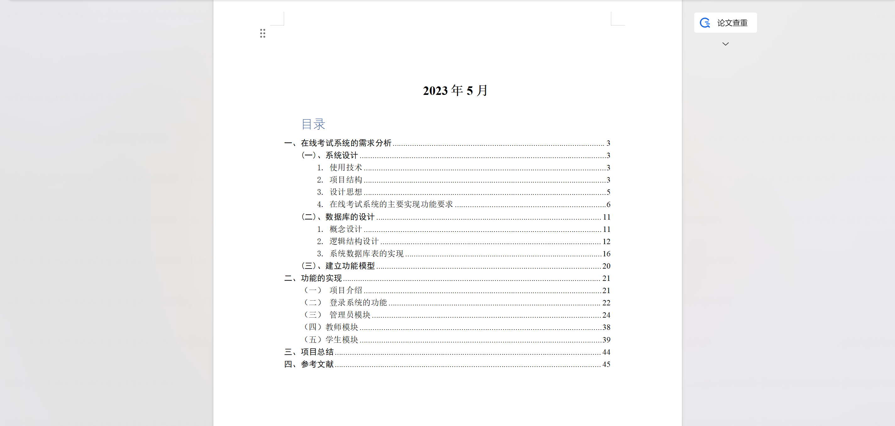
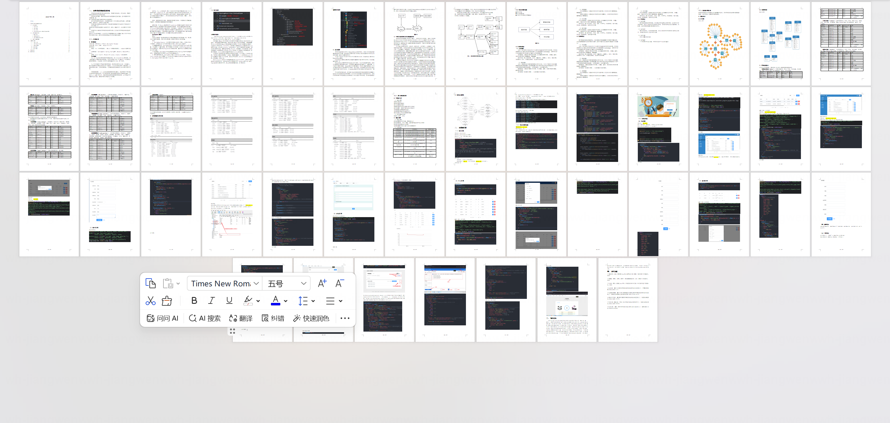
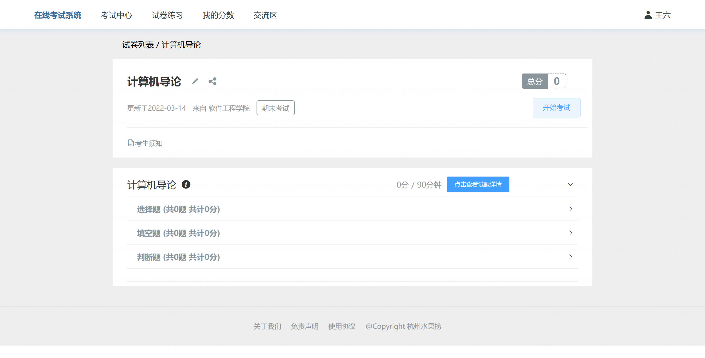
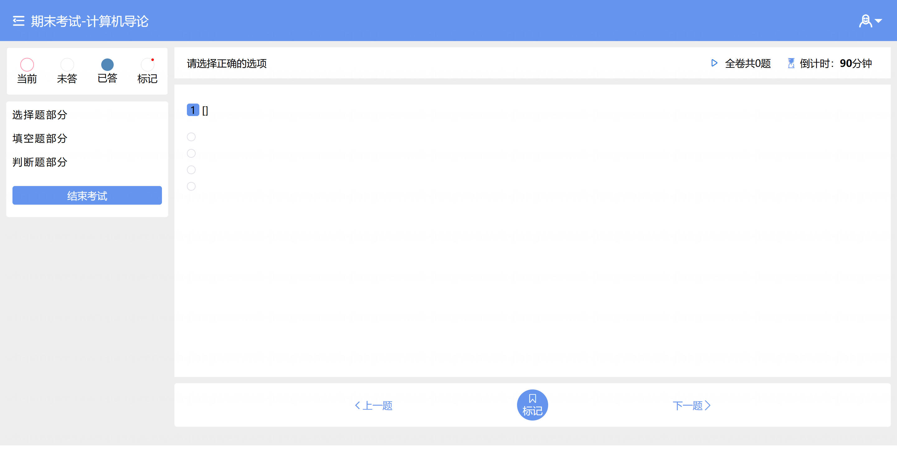
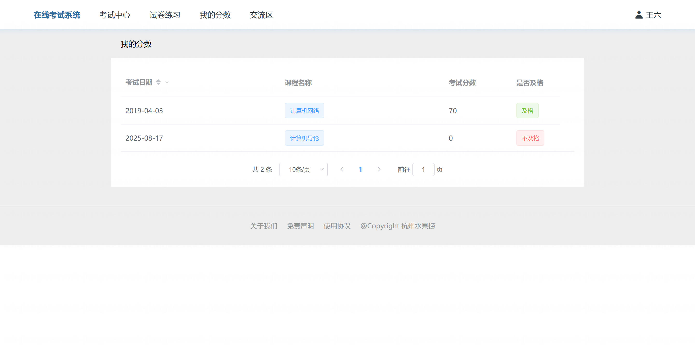
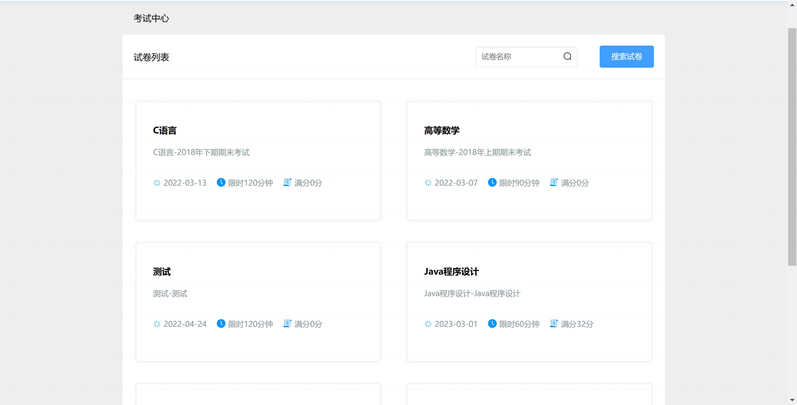
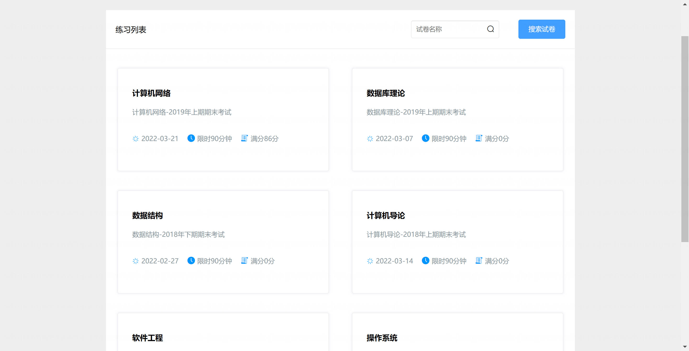
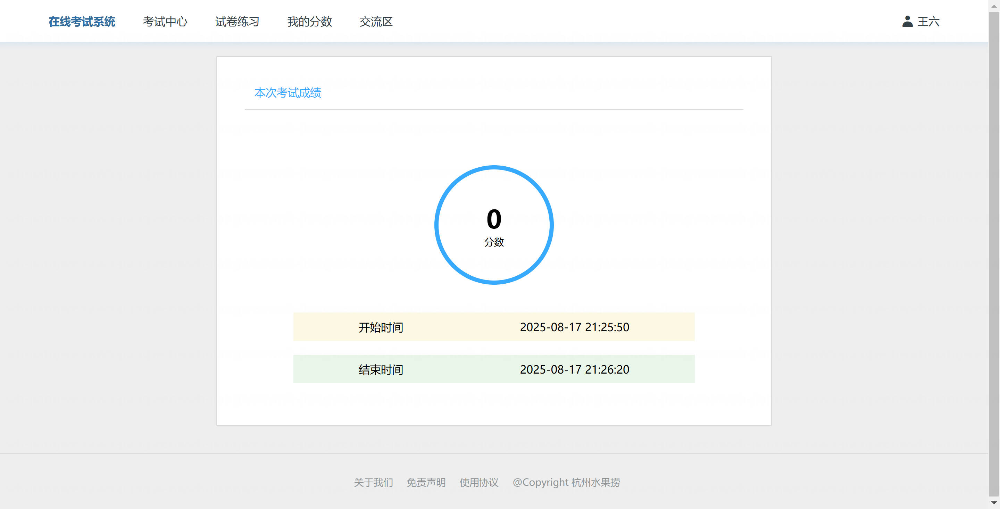
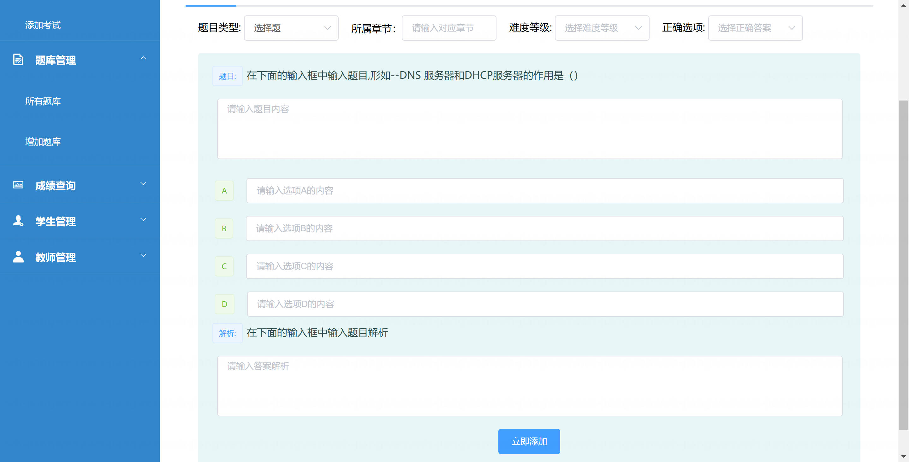
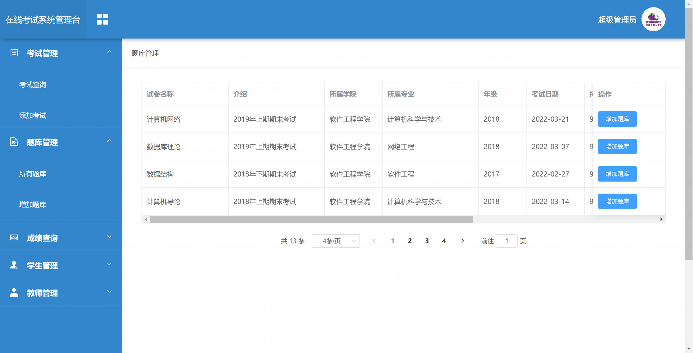

<h1 align="center">基于SpringBoot+Vue的在线考试系统【带论文】</h1>

- <b>完整代码获取地址：从戎源码网 ([https://armycodes.com/](https://armycodes.com/))</b>
- <b>技术探讨、资料分享，请加QQ群：692619798</b>
- <b>作者微信：19941326836  QQ：3645296857</b>
- <b>承接计算机毕业设计、Java毕业设计、Python毕业设计、深度学习、机器学习</b>
- <b>选题+开题报告+任务书+程序定制+安装调试+论文+答辩ppt 一条龙服务</b>
- <b>所有选题地址 ([https://github.com/Descartes007/allProject](https://github.com/Descartes007/allProject)) </b>

## 一、项目介绍

基于SpringBoot+Vue的在线考试系统，系统角色为 管理员 / 教师 / 学生，主要功能如下：
### 管理员：
- 基本操作：登录、登出、修改密码、获取/修改个人信息
- 用户管理：教师/学生/管理员的增删改查、分页与筛选
- 考试管理：新增/查询/分页/删除考试
- 试卷管理：创建试卷、查看试卷题目（选择/填空/判断按类型返回）、从试卷删除题目
- 题库管理：选择题、填空题、判断题的 CRUD
### 教师：
- 基本操作：登录、登出、修改密码、个人信息维护
- 题库维护：管理课程题目（增删改查）
- 组卷与管理：创建/编辑试卷、查看试卷题目、删除试卷题目
- 批改评分：查看学生提交、批改/发布成绩
### 学生：
- 基本操作：登录、登出、查看/修改个人信息
- 参加考试：获取试卷题目（按题型返回）、提交答卷
- 查看成绩：查看个人考试成绩与历史记录

## 二、项目技术

- 编程语言：Java（后端）
- 项目架构：B/S 架构（前后端分离）
- 前端技术：，Vue 2.x、vue-router、Vuex，Element-UI，axios、vue-cookies，echarts
- 后端技术：，Spring Boot 2.1.2、Spring JDBC、spring-tx（事务），MyBatis-Plus，MySQL，Druid

## 三、运行环境

- JDK版本：1.8及以上都可以
- 操作系统：Windows7/10、MacOS
- 开发工具：IDEA、Ecplise、MyEclipse都可以

## 四、数据库配置文件

- npm版本：6.14.13及以上都可以
- Redis版本：3.2.100及以上都可以
- 文件名：application.yml
- 编码类型：utf8

## 论文截图

## 系统截图

